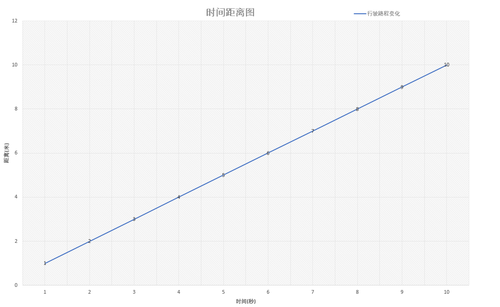
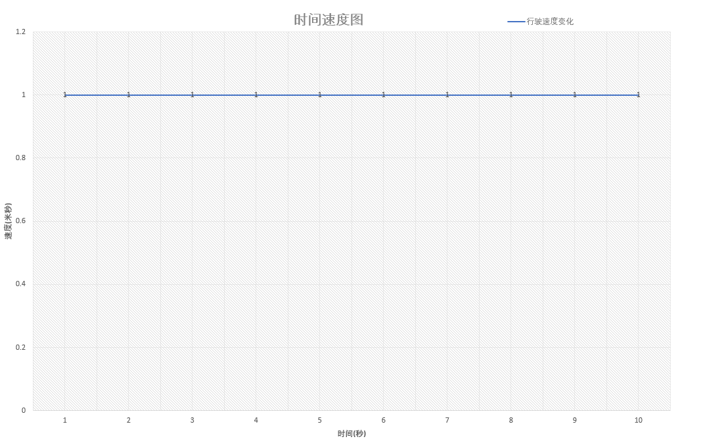

#《关于时间的不存在性》
```txt
注：本文尝试探究悉达多在跳入河中顿悟时间不存在性后如何建立其完整的世界观，指导其生活。
    文中的逻辑主要包括三个部分：
        1. 通过佛家公案引入时间的不存在性
        2. 以物理学的角度来论证时间的不存在性
        3. 以黑塞《悉达多》一书中的悉达多为例，尝试以时间不存在性解读其生活状态，并尝试基于此原理构建一个世界观。
```

## 引文

> 禅宗有一段著名的偈子：万古长空，一朝风月

```txt
偈子源于下面这段公案：
    教授师：“达摩未到此土时，还有佛法也无？”

    崇慧法师：“未来时且置，即今事作么生？”

    教授师：“某甲不会，乞师指示。”

    崇慧法师：“万古长空，一朝风月。”

    良久，教授师还是不懂
```
那么对于这段我们如何理解呢？首先我们来尝试解读一下原意。
```txt
万古长空意味着时间的长跨度，一朝风月而意指当下。前者是教授师的观察角度，而后者是崇慧法师的观察角度。

教授师为了了解中原的佛法发展状况，引入了时间这一维度，借以观察其发展的变化状况。借以时间将主体分为多段，来观察每一段的性质，所以有了达摩来之前，达摩来之后这一说法。

崇辉法师则是立足于当下，以当下世界为主体，抛却时间的庸扰。主体只是主体，并非分过去的主体、现在的主体、未来的主体。这不过是我们观察的障碍，耽误我们与当下世界的圆融统一。中原的佛法从来就不分达摩来之前，达摩来之后，中原的佛法与时间无关，从来都存在。亦如《杂阿含经》中所言：“若佛出世，若未出世，此法常在”。佛法一直都在中原大地存在，同样每个人身上亦是如此，每个人身上都有佛性，自性成佛。

我们引入时间借以观察事物，但是时间却悄然将事物本身撕裂，并尝试以部分替代本体，迷失其中。这一切的一切都是在侵蚀事物的本质。抛去时间的外壳，我们才得以观察事物的本质内容。

那么真正的问题就来了，依据崇慧法师的说法，万古长空为虚，一朝风月为实。时间真的存在吗？
```
# 论证

首先需要回忆一下，我们关于时间的定义从何而来，它仿佛与生俱来，而且不言自明。但是我们感受到的时间究竟是怎么样呢？不妨帮助大家会议一下。

我们关于时间最系统的认知来源于匀速运动这一课（这一课可能来自于小学数学，也可能来自于初中物理的第一课）。主要介绍了如下这个式子：

H = V * T (某物体A，以速度 V 匀速前行，经过 T 时间，行驶了 H 的距离) 

同时，为了更好探讨时间T具有的性质，尝试结合图表进行分析。




借助上述两个图来尝试具象化一下根植于我们内心的一些关于时间的特性。
时间具有一下性质: 独立性、均匀性、绝对性、方向性


首先从上述的左图来理解：

时间的独立性、均匀性、方向性：

从图中我们可以看到，时间轴是垂直与速度和路程(位置)。按照正交坐标系的理解，正交意味着彼此独立存在，因此我们可以看到时间是具有“独立性”。换句话说：时间是独立存在于自然界，不受任何因素的影响。

同时，我们看到时间轴不仅垂直于速度、路程(位置)，而且在不同速度或者路程(位置)保持相同的变化尺度，因此我们可以清楚的感知到时间是具有“均匀性”。换句话说：时间在每个地方的流速都是一致的，以均匀的速度穿过一切物体。

时间不论在哪个表中，都是具有一个方向，因此我们可以清楚感知到时间是具有方向性的。换句话说：时间是从过去流向未来，即：熵增的方向（自然界总是从有序的变成无序的）。

当然，时间还有其他两个特性：统一性、绝对性。

每年除夕，大家都会团坐在电视机前观看春晚。在零点，主持人会告诉大家新年的钟声敲响，我们进入新的一年。同时，全国各地的人们在那一刻都知道农历新年到来。因此我们可以感受到，幅员辽阔的大地上都有一个共同的此刻，此刻是统一的。因此，我们可以清楚地感知时间是具有“统一性”的。换句话说，此刻对于每个人都是在统一的时间系统中，处在统一的此刻，并非每一个人都以一个单独的时间系统。

当我们处在一个地方任何事情都不做，时间同样会不断的流逝，它是一个先验的存在。


诸上的特性都只是根植于心中的时间特性，那么他来源于哪里呢？它并非源自我们对于世界的感知，而是我们接受的基础教育，是来自于牛顿的经典力学。那么牛顿的经典力学中的时间从物理学上是否真的站得住脚呢？

我将用实际的例子一一否定时间的相关特性。

我们可以观察20世纪美军所做的一个实验。

从上述的实验中，我们清楚地看到时间的独立性、均匀性已经悄然崩塌，它是受到引力(位置)和速度的影响的。

接下来我们一起来否定时间的其他三个特性：方向性、统一性、独立性。

方向性：首先我们需要还原一下方向性。时间的方向是我们通过熵来确定，根本依据是热力学第二定律：时间不可能从热量低的地方流向热量高的，而不引起其发生变化。所以时间的方向就是熵增的方向。但是熵从定义开始，就是源于我们对世界的观察，是基于我们对所在的系统基本情况的一个设定，并非所有的都是熵增。其次，熵增真的是熵增吗？举个简单的例子，我们有一副崭新的扑克牌，它按照花色和次序排列，洗完牌，我们认为它是无序的。我定义这是个熵增的过程，但是我们只是从一些的花色和次序来界定，如果我们加入牌面粗糙的程度、每张牌页的原子个数多少呢？还是从有序变成无序吗？熵只是源于我们无法细致感知世界而引入的工具，时间并非一定是由过去流向未来。


时间的统一性: 我们可以举一个简单的例子：我们和身旁的人说你现在在干嘛，和对面山的人说你现在在干嘛？前者能保持对此刻的精确把握，而后者却又很强的延迟感。其实我们对此刻有了误差，当然这种我们可以说我们通过具体的时间点来避免有声音传播的延迟而导致对“此刻”的误解。那接下来我再举一个例子：我们通过第一个实验已经可以清楚看到在不同的地方时间流速是不一致的，比如我带着一本时间跨度为十年日历出发到仙女星，因为时间的膨胀，走一圈回来后，我已经度过了十年，但是地球上只过了五年，那么这五年的时间怎么对应10年中的时间？此刻如何对应呢？就好像一个六个指头的手，手套却只有五个指头，我要怎么对应呢？


独立性：我们从惠德方程可以明确看到，世界的变化是没有时间这个自变量，是与时间无关的一个存在。


从上面的一个个例子，我们可以清晰的看到时间是不具有存在性的，至少从现有的物理学是可以推翻牛顿所定义的物理学。

那么我们剥离掉这层虚假的外壳，这个世界将要怎么进行有序的生活？如果我们不能完成意义上的自洽，反而会陷入一种剥离后的无序感和虚无感。接下来我们将尝试在黑塞的《悉达多》中寻找一个基于时间不存在而构建的世界，去解读这种生活理念。

## 悉达多中时间不存在的世界

为了更好的阐述其世界观，需要先对背景做一个简要的介绍。针对的背景是悉达多在经历声色犬马的生活后，跳入河中寻求解脱。大难不死，顿悟时间的不存在性后，开始了进入智者的生活模式，进入倾听的生活。

悉达多在证得时间不存在性后如何实现生活状态的改变。

主要是集中在两个问题：
1. 悉达多如何从一个厌恶自身的人，转而成为一个没有任何包袱的人。
//时间是如何引入过去未来，并且由此让人产生痛苦和未来的焦虑。


2. 悉达多是如何变成一个善于倾听的人
//变得善于倾听，实则是他开始听从内心真实的声音后发生的转变。

首先我们来回忆一下，悉达多是如何变得善于倾听，是跳入河中后。文中对于他跳入河中写得很隐晦，但是结合心理学的考察，可以感受到悉达多是经历过了一次死亡，经过切身的死亡后开始认知内心真实的想法。因此我们也尝试通过死亡这一手段来窥探悉达多的转变。
//存在主义心理治疗 死亡对人的引导。


当然死亡教会人如何去选择，但是在选择后如何去做，把需要做的事情，用合适的手段表达，以及在合理的尺度表达，也是需要去学会。


