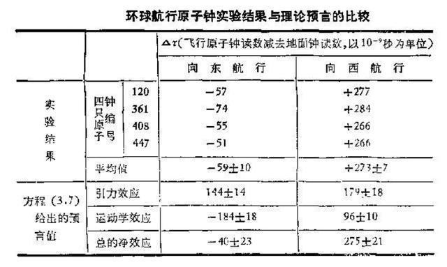

# 《关于时间的不存在性》
```txt
注：本文尝试探究悉达多在跳入河中顿悟时间不存在性后如何建立其完整的世界观，指导其生活。
    文中的逻辑主要包括三个部分：
        1. 通过佛家公案引入时间的不存在性
        2. 以物理学的角度来论证时间的不存在性
        3. 以黑塞《悉达多》一书中的悉达多为例，尝试基于时间不存在性来解读其如何实现顿悟，并开启倾听的生活状态。
        //这个尝试失败了：尝试基于此原理构建一个世界观
```

## 引文

禅宗有一个著名的偈子：万古长空，一朝风月

```txt
偈子源于下面这段公案：

    教授师：“达摩未到此土时，还有佛法也无？”

    崇慧法师：“未来时且置，即今事作么生？”

    教授师：“某甲不会，乞师指示。”

    崇慧法师：“万古长空，一朝风月。”

    良久，教授师还是不懂
```

万古长空意味着时间的长跨度，一朝风月而意指当下。前者是教授师的观察角度，而后者是崇慧法师的观察角度。

教授师为了了解中原的佛法，引入了时间这一维度，借以观察其发展的变化状况。借以时间将主体分为多段，来观察每一段的性质，所以有了达摩来之前，达摩来之后这一说法。

崇辉法师则是立足于当下，以当下世界为主体，抛却时间的庸扰。主体只是当下的主体，并非分过去的主体、未来的主体。这不过是模糊我们的障眼法，汲汲于过去，汲汲于将来，杂念丛生，与当下世界失之交臂，与圆融统一格格不入。过去心不可得，未来心不可得，万法皆如，俱入目前。

中原的佛法从来就不分达摩来之前，达摩来之后，中原的佛法与时间无关，从来都存在。亦如《杂阿含经》中所言：“若佛出世，若未出世，此法常在”。佛法一直都在中原大地存在，同样每个人身上亦是如此，每个人身上都有佛性，自性成佛。我们引入时间借以观察事物，但是时间却悄然将事物本体撕裂，并尝试将本体从自身异化出去，侵蚀事物的本质。抛去时间的外壳，我们才得以观察事物的本质。

那么真正的问题就来了，依据崇慧法师的说法，万古长空为虚，一朝风月为实。时间真的存在吗？

## 论证

### 时间的性质

首先需要回忆一下，我们关于时间的定义从何而来。它仿佛与生俱来，且不言自明。


我们尝试追溯一下我们对于时间第一次系统的认知。关于时间最系统的认知来源于匀速运动这一课（这一课可能来自于小学数学），其数学表达式为：

H = V * T (某物体 A ，以速度 V 匀速前行，经过 T 时间，行驶了 H 的距离) 

同时，为了更好探讨时间T具有的性质，尝试结合图表进行分析。


借助上述两个图来尝试具象化一下根植于我们内心的一些关于时间的特性。

从两个图中我们可以看到，时间轴是分别垂直于速度轴和路程(位置)轴。按照正交坐标系的理解，正交意味着彼此独立存在，不受到任何因素的影响。

> 时间具有“独立性”。换句话说：时间是独立存在于自然界，不受任何因素的影响。

同时，我们看到时间轴不仅垂直于速度、路程(位置)，而且在不同速度或者路程(位置)保持相同的变化尺度，因此我们可以清楚的感知到时间是均匀穿过每个物体，保持相同的流速。

> 时间具有“均匀性”。换句话说：时间在每个地方的流速都是一致的，以均匀的速度穿过一切物体。

两个坐标轴中，时间轴都是具有一个方向，是从过去指向未来。

> 时间具有“方向性”。换句话说：时间从过去流向未来，即：熵增的方向（自然界总是从有序的变成无序的）。

当然，时间还有其他两个特性：统一性、绝对性。我们可以借助一些其他的例子来揭示：

每年除夕，大家都会团坐在电视机前观看春晚。在零点，主持人会告诉大家新年的钟声敲响，我们进入新的一年。同时，全国各地的人们在这一刻都知道农历新年到来。因此我们可以感受到，幅员辽阔的大地上都有一个共同的此刻，此刻是统一的。对于每个人都有一个确定的唯一的共同的此刻。

> 时间具有“统一性”。换句话说，此刻对于每个人都是在统一的时间系统中，处在统一的此刻，并非每一个人都以一个单独的时间系统。

什么是绝对性呢？当我们出生的时候，墙壁上的时钟就在不停地转动。随着指针的不断流逝，从婴儿到青年，而后暮年悄然又逝去。我们的一生都在时间中度过，但是时间从来都不改变停歇。它仿佛与生俱来，从古至今都保持着它的独立性、均匀性、方向性、统一性，波澜不惊。

> 时间具有“绝对性”，它是一个先验的存在。


诸上的特性都只是根植于心中的时间特性，那么他来源于哪里呢？它并非源自我们对于世界的感知，而是我们接受的基础教育，是来自于牛顿的经典力学。那么牛顿的经典力学中的时间从物理学上是否真的站得住脚呢？（不要过分相信我们的教育！！！！！！！！！！！！！！！！你永远要记得我们极可能成为它的奴隶！）

### 时间的谬误

震惊！！！德国贵族 莱布尼茨 本名居然是  Leibnitz 而不是 Leibniz？？？

Leibnitz 和 Leibniz 有什么区别？前者是父母给的名字，后者是晚年自己的改的名字。改名的起因是莱布尼茨 对牛顿提出的时间理论嗤之以鼻，并回之以强烈的反驳，认为时间知识事件发生的顺序，并不存在自发的时间。为了表示不苟同的态度，坚定自己的信仰，愤而删去了名字名字中的t。

你看，他急了！他急了！

接下来将一一否定时间的五个特性。

~~独立性、均匀性、~~ 

我们可以观察20世纪美国海军天文所Hafele和Keating两位科学家做的一个实验。

1971年，两位科学家(Hafele和Keating)利用数台铯原子钟，其中四台放到飞机里，地面上留一台作为标准钟，随后让飞机在赤道附近环球飞行，一次往西一次往东，每次耗费的时间大约是三天，最后看飞机上的原子钟和地面原子钟的时间差异。



// 此实验基本假设，铯原子的自旋超级稳定，周期可以认为时间的基本衡量标准。

实际值：向东飞行一圈，飞机上的时间比地面慢了59纳秒左右；而向西飞行时，飞机上时间比地面时间快了273纳秒左右。

可以发现，飞机在向东和向西绕地球一圈后原子钟的差异还是很明显的，并且表中还给出了相对论的预计值，可以发现二者在误差范围内的数值还是很接近的。

从上述的实验中，我们清楚地看到时间的独立性、均匀性已经悄然崩塌，它是受到引力(位置)和速度的影响，同时在太空时间会犹豫引力变小，引发膨胀。

再举一个简单例子，太空卫星携带的原子钟需要调表。

 ~~方向性、~~ 

 接下来我们来看一下方向性。
 
 首先我们需要还原一下方向性。时间的方向是我们通过熵增的方向来确定。根本依据是热力学第二定律：热量只能从高温的物体流向低温的物体。高温的分子因为受热躁动起来，分子间相互碰撞，推动旁边低温的分子运动，分子因为运动变得混乱，高温分子失去热量，低温分子获得热量。整个热传导的过程，依靠自然界自发的无序化，热量从高温流向低温，实现熵增。

 通过熵增这一理念，可以简单知道过去是有序的，未来时无序的。但是我们何以确定过去是无序的？未来时无序的呢？举个简单的例子，一百个人按照班级高矮排列成 10 X 10 的队伍，解散口令一响，队伍变成三三两两杂乱无章。整个过程我们可以看做是熵增的过程。从有序的班级高矮男女变成杂乱的小群体。但是这只是我们观察的一个简单维度，如果从兴趣团体呢？从被割裂的小团体变成了聚集在一体的小团体，所有的人都找到了自己的团体，难道不是变得有序？从无序变得有序？我们所定义的有序、无序、熵都是在当下的知识体系下所局限的认知、在当下这个地球系统内所形成的认知，只是一种模糊与近似的认知。如果我们把所有事物的所有特性都纳入（高矮胖瘦、兴趣、男女、等等）、把所有系统的状态都纳入（地球、仙女星、等等），这个世界还是熵增吗？过去有序还是未来更有序？

 ~~统一性、~~

我们可以举一个简单的例子来了解时间的统一性：询问身旁的人“你现在在干嘛？”，和对面山谷的人说“你现在在干嘛？”。前者能保持对此刻的精确把握，而后者却又很强的延迟感。其实我们对此刻有了误差，当然这种可以理解成：因为声音传播的延迟而导致对“此刻”的误解。

那接下来我再举一个例子：我们通过四个铯原子钟的实验已经可以清楚看到在时间的流速不一致。比如我带着一本时间跨度为十年日历出发到仙女星，因为时间膨胀，走一圈回来后，我已经度过了十年，但是地球上只过了五年（也可能是7年，总之少于10年），那么这 5 年的时间怎么对应 10 年中的时间？地球的此刻如何对应我的此刻呢？就好像一个10个人，只剩下5个座位。统一的“此刻”，已经显得不合时宜。当场景延伸到整个宇宙，时间已经不在存在统一性。每个位置和自己的领域都构成自己独立的时间系统，每个系统都有自己独立的此刻。

~~绝对性、~~

在聊独立性之前，先来看看现有的一些物理学趣事。

量子论和广义相对论是当代物理学的两大支柱，但是将其综合考虑时，时间的问题接踵而至。上世纪60年代，美国物理学家 布莱斯·德维特 在惠勒的启发下定义了婴儿期宇宙的量子波函数，将薛定谔和爱因斯坦的数学思想相结合得出一个方程，尝试解释早期宇宙是如何在量子物理学和相对论的共同作用下历经时间不断演进而来的。这就是如今我们所熟知的惠-德方程。尽管如此，正如林德所言：“这个方程惠勒从不引用，德维特也不喜欢。实在是一个怪异又深奥的方程。”因为在这个方程中，时间变量 t 消除了。

德维特的宇宙波函数方程显示，宇宙并无演化，或者随着时间流逝有任何改变。这样一来，宇宙就不应该从一个小小的奇点，或者种子星宿，星系，行星或者人类中逐渐扩展外延。而应该仅仅是冰冻状态。林德看来：“这是一个定理，”，“时间的问题在于它只是一个幻觉，从基本层面上说，时间这种东西并不存在。”

我想毋需再多言啦？时间？以后可以加个状语啦，牛顿的时间（手动狗头）

从上面的一个个例子，我们可以清晰的看到时间的特性是站不住脚的，至少从现有的物理学是可以推翻牛顿所定义的物理学。

## 悉达多中时间不存在的世界

我们剥离掉这层虚假的外壳，世界将会陷入一种什么样的状态？如果我们不能完成意义上的自洽，那将会陷入一种空心的无序感和虚无感。

接下来我们将尝试在黑塞的《悉达多》为例，解释悉达多如何在“时间不存在”的基础上实现顿悟。

先对背景做一个简要的介绍：

```txt

悉达多在加摩拉和加摩湿弥生的交际中，陷入一种堕落腐朽的生活。这种滚雪球式的欲望，终究在某一天破裂，他开始清醒了。他开始厌恶自己的逃离以往的生活，对颓废腐败的身躯感到厌恶，希望毁灭肉身获得安宁。
```
文章中关于悉达多顿悟主要包括两个部分：

1. 生活态度的转变：悉达多从厌恶自身、毁灭自身的态度转换成冷静面对生活的人。


悉达多在证得时间不存在性后如何实现生活状态的改变。

主要是集中在两个问题：
2. 悉达多开始学会倾听。 
//时间是如何引入过去未来，并且由此让人产生痛苦和未来的焦虑。


3. 悉达多是如何变成一个善于倾听的人
//变得善于倾听，实则是他开始听从内心真实的声音后发生的转变。

首先我们来回忆一下，悉达多是如何变得善于倾听，是跳入河中后。文中对于他跳入河中写得很隐晦，但是结合心理学的考察，可以感受到悉达多是经历过了一次死亡，经过切身的死亡后开始认知内心真实的想法。因此我们也尝试通过死亡这一手段来窥探悉达多的转变。
//存在主义心理治疗 死亡对人的引导。


当然死亡教会人如何去选择，但是在选择后如何去做，把需要做的事情，用合适的手段表达，以及在合理的尺度表达，也是需要去学会。


